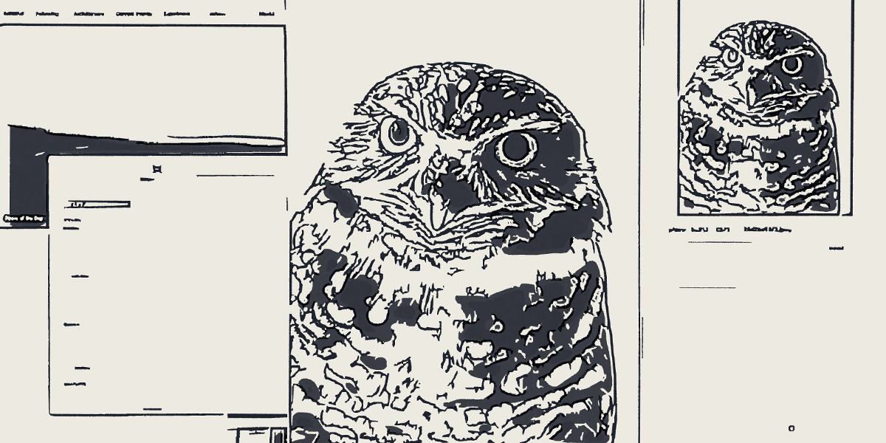

# InVision Screens List Bookmarklet

Photo by [Leah Smit](https://unsplash.com/@4cats?utm_source=unsplash&amp;utm_medium=referral&amp;utm_content=creditCopyText) on [Unsplash](https://unsplash.com/s/photos/owl?utm_source=unsplash&amp;utm_medium=referral&amp;utm_content=creditCopyText)

## 概要
InVisionのプロジェクトから、スクリーンの一覧を取得して整形するブックマークレットです。  
取得する対象のページは2種類で、プロジェクトページと共有ページで表示されるスクリーンです。

例：
```
---

# Project Title

## Divider Title 1

Screens Title A
https://projects.invisionapp.com/share/[Share ID]]#/[Screnn ID]

Screens Title B
https://projects.invisionapp.com/share/[Share ID]]#/[Screnn ID]

## Divider Title 2

Screens Title A
https://projects.invisionapp.com/share/[Share ID]]#/[Screnn ID]

Screens Title B
https://projects.invisionapp.com/share/[Share ID]]#/[Screnn ID]

---
```

## 特徴
- プロジェクト名、ディバイダー名、スクリーン名、スクリーンURLを取得して整形します。
- [main.js](./main.js)を直接編集して、各項目の接頭辞と接尾辞を変更できます。

## 使い方

### 準備
- [このページ](https://kskg.github.io/bookmarklet-invision-screens-list/)にあるリンクをブラウザのブックマークバーにドラッグ＆ドロップして保存する。
- もしくは、不要なブックマークのアドレスを[main.min.js](./main.min.js)のコードに書き換える <sup><a name="1">[^1](#notes_1)</a></sup>

### プロジェクトページのスクリーンを取得する
1. InVisionのプロジェクトを開く
2. URLが`https://projects.invisionapp.com/d/main#/projects/prototypes/[Project ID]`であるか確認する
3. ブックマークレットを実行する

### 共有ページのスクリーンを取得する
1. InVisionのプロジェクトを開く
2. ヘッダーにある「Share」ボタンを押す
3. モーダル下部の「public share link」か「Link Settings」リンクを押して共有URLを発行する
4. 共有URLにアクセスし、画面右下の「Screens」ボタンを押す
5. URLが`https://projects.invisionapp.com/share/[Share ID]#/screens?browse`であるか確認する
6. ブックマークレットを実行する

## 開発環境
- MacOS 10.15.6
- Safari 14.0
- jQuery 2.2.4

Mac OSのSafari、Google Chromeで動作確認済みです。

## 注意事項
InVisionの仕様変更により、動作しなくなる可能性があります。

## 脚注
<a name="notes_1">[^1](#1)</a>: 速度を重視して[Closure Compiler](https://closure-compiler.appspot.com/home)でコードの圧縮・最適化をしています。  

## 作者
- [GitHub](https://github.com/kskg)
- [Twitter](https://twitter.com/kskg)

ご意見、ご感想はお気軽にください。開発の参考にさせていただきます🤓

## ライセンス
MIT